<div align="center">


[](https://www.linkedin.com/in/tejaswin-amara/)
[](https://github.com/tejaswin-amara)


</div>

```text
$ whoami
Tejaswin Amara — B.Tech CS&IT (Y25), KL University, Hyderabad

$ status --current
Trisemester PBL program. Building Sovereign-OS, an AI agent
governance framework, plus campus tools and Origins platform work.

$ philosophy
Verify against source, not against the docs.
```

## 🛠️ Currently building

- 🛡️ **[Sovereign-OS](https://github.com/tejaswin-amara/Sovereign-OS)** — a PowerShell-based AI agent governance framework: audits, verified documentation, persistent agent directives
- 📶 **[KL Sync](https://github.com/tejaswin-amara/kl-sync)** — an unofficial attendance-tracking PWA and ERP client for KL University
- 🎮 **[Quiz Platform](https://github.com/tejaswin-amara/Quiz-Platform)** — a full-stack real-time multiplayer quiz app
- 🧠 **KLU Personal Assistant** — a PWA and knowledge-base assistant for academic tracking
- 🌐 UI/UX, agent docs, and sprint planning for **Origins**, a national student community platform
- 🧰 A Claude Code skill fleet — `gstack`, `ruflo`, `humanizer`, `skill-creator`, `graphify`

## ⚡ Stack

<div align="center">

**Languages**

   

**Frameworks & Libraries**

    

**AI & Infra**

      

</div>

## 📊 GitHub stats

<div align="center">


</div>

<div align="center">


</div>

## 🎯 Quick Stats & Skills

<div align="center">


</div>

<div align="center">



</div>

## 🐍 Contribution graph

<!-- Renders once the included snake.yml workflow has run once — see setup notes. -->
<picture>
  <source media="(prefers-color-scheme: dark)" srcset="https://raw.githubusercontent.com/tejaswin-amara/tejaswin-amara/output/github-contribution-grid-snake-dark.svg" />
  <source media="(prefers-color-scheme: light)" srcset="https://raw.githubusercontent.com/tejaswin-amara/tejaswin-amara/output/github-contribution-grid-snake.svg" />
  
</picture>

## 📌 Featured projects

<div align="center">

<a href="https://github.com/tejaswin-amara/Sovereign-OS"></a>
<a href="https://github.com/tejaswin-amara/kl-sync"></a>
<a href="https://github.com/tejaswin-amara/Quiz-Platform"></a>

</div>

Also shipping **Campus Connect** (Java + Spring Boot/Thymeleaf event platform) and a **Smart Grid Load Decision Agent** (SAC reinforcement learning over a Gymnasium environment).

## 🏆 Milestones & Impact

<div align="center">


</div>

## 📚 Research & publications

- **Privacy-Preserving IoMT Security using Federated Learning** — presented at ICACIML 2026 (March 2026). Research into distributed machine learning approaches to protect Internet of Medical Things infrastructure.
- **Agri-tech AI initiatives** — active research in plant disease detection for Indian crops and soil health analysis. Training models for stakeholder adoption in agricultural technology.
- **2026 Google Solution Challenge** — "Build with AI" edition participant, exploring AI-driven solutions to real-world problems.

## 🎯 On-campus work

- **Chief Technology & Strategy Officer**, Origins Asia — overseeing strategic transition across distributed offices in Hyderabad, maintaining backend infrastructure, integrating project audits for management.
- **Viwentiaa 2026** — organized technical events for campus festival; created the core question bank for **WATT-THE-QUIZ** (electronics and logical reasoning competition).
- **Academic coordination** — drafted "Friendship Resource Allocation" memo for peer logistics; manage documentation precision (digital signatures, affiliation accuracy) for close collaborators.

## 🌸 Creative work

- **Digital cinematography & photography** — drawn to vintage and Y2K aesthetics. Experiments with **Kapi Cam** and **Dazz Cam** film presets.
- **Minimalist strategic games** — especially **Mini Metro** and **Mini Motorways**; influenced by clean interaction design.

## 🤝 Collaborators

Working closely with [Abhiram](https://github.com/), [Aditya Srujn Poduri](https://github.com/), [Arya Anumula](https://github.com/), [Asish Kadali](https://github.com/), [Mourya Anumula](https://github.com/), [Obuli Vignesh](https://github.com/), [Srivanth Ganga](https://github.com/), and [Pranay](https://github.com/) — spanning academics, projects, and community coordination.

## 📞 Get in touch

- **Email**: tejaswinamara@klh.edu.in
- **LinkedIn**: [@tejaswin-amara](https://www.linkedin.com/in/tejaswin-amara/)
- **GitHub**: [@tejaswin-amara](https://github.com/tejaswin-amara)

---

<div align="center">

<sub>
Last updated: July 2026 · Autonomous updates powered by GitHub Actions · Read the source — trust the audit
</sub>


</div>
